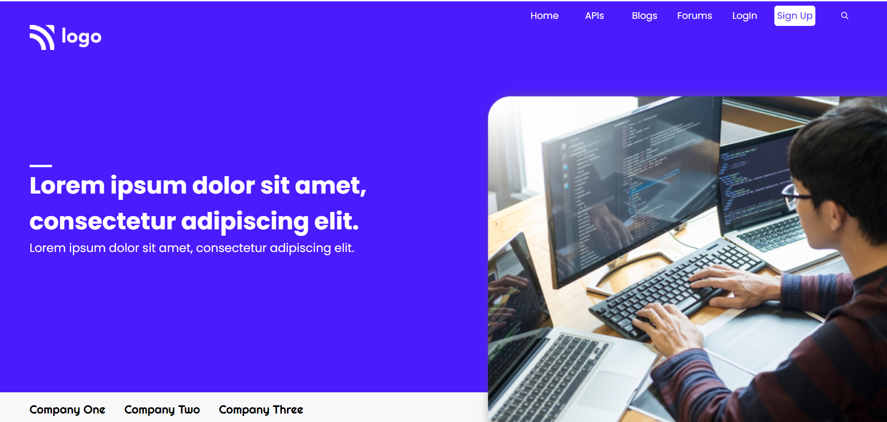

# **Developer Landing page | Project_09**

Hi, I'm **Hemanth Kumar R**

This is a static one page portfolio Template made using HTML & CSS

### **What I have learned ?**

-used `grid` instead of `flex-box` for some sections.
-used `repeat` and `Minmax` in `grid`.
-used `:nth-child()` selector for pseudo elements.

### **Time spent to finish it.**

It took me 8 hours to make this project.Please find link of the project below.

**[Live Project's netlify link](https://resilient-starburst-50f73d.netlify.app/ "Project link")**

